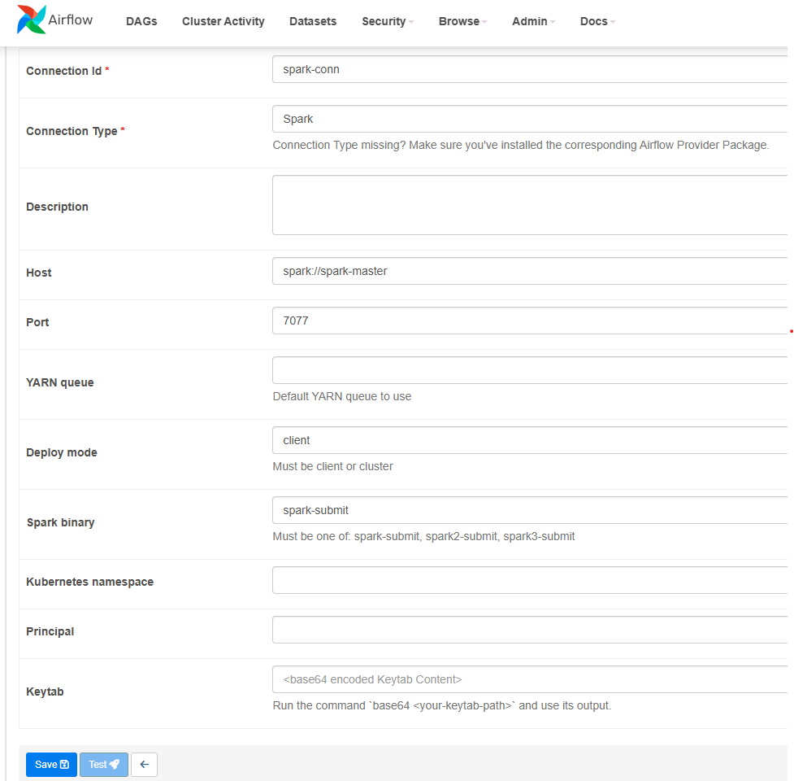
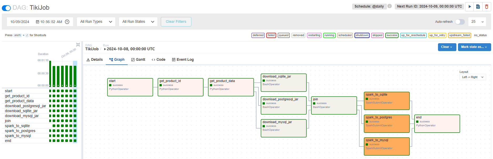

# A workspace to experiment with Apache Spark and Airflow in a Docker environment

## Prerequisites Setup

- Postgresql (pgAdmin 4)
- MySQL
- Sqlite

Remember to change username, password, database, table with yours

## Quick Setup

Create airflow-spark cluster

    docker compose up -d  
    # need to run twice to start webserver after init db

Access webserver at `localhost:8080/home`, username `admin` password `admin`

Set up Spark connection to Airflow

## TikiJob Architecture

> `.\env\Scripts\activate`